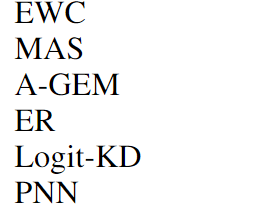
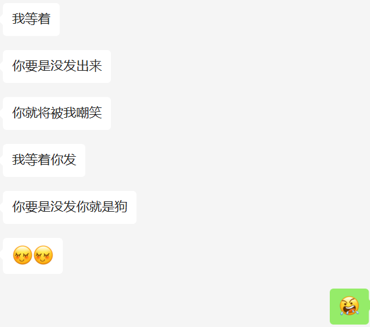

2 challenge: 

- efficient knowledge growth
- proper knowledge stimulation

2 main works:

- function preserved model expansion --- expand model size and improve training efficiency（有一个复原能力？回归到原始状态去适应一个新domain?）
- domain prompt --- 提前植入领域知识并且可以复用

这篇文章总结出来的LLL的三类方法：

- memory-based: 经验重现
- consolidation-based: 额外惩罚项，对于参数重要性
- dynamic architecture: 固定旧任务的主要网络骨干，而添加新网络分支

上面这几个LLL方法是值得学习的！ 

这个龟孙子说我今天要不发，将被狠狠嘲笑

