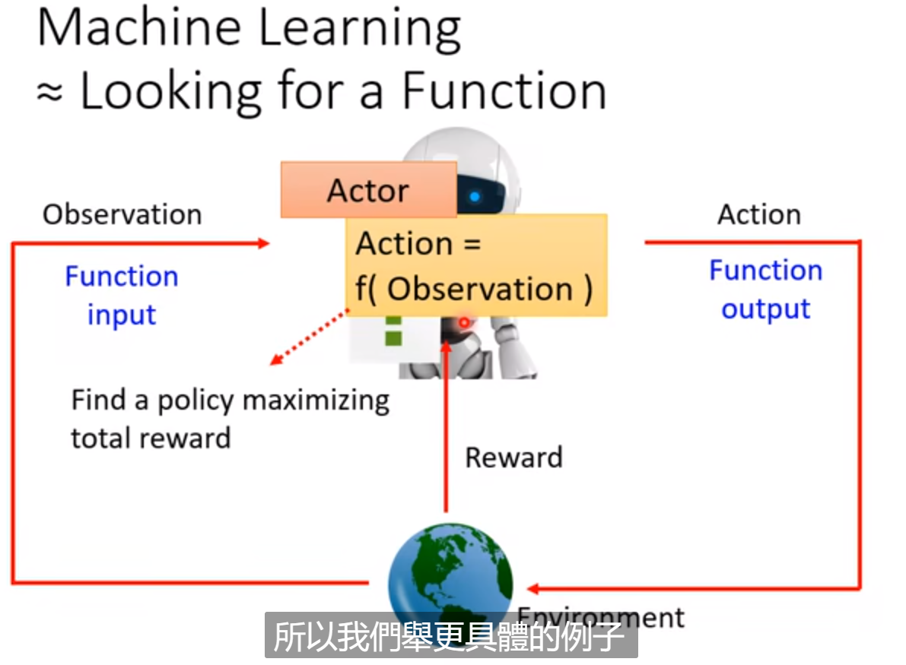
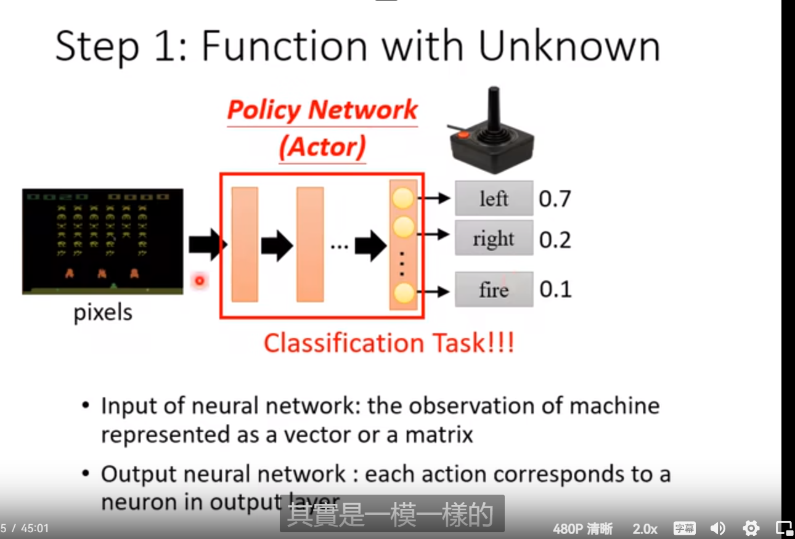
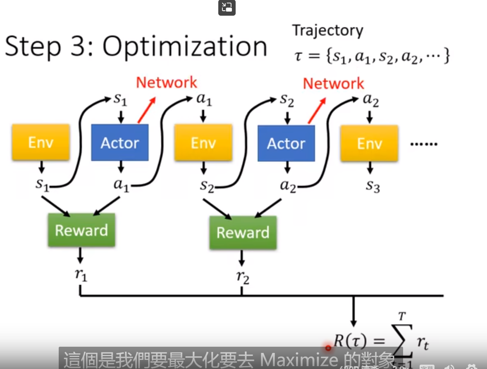

## [Task12] Lhy_ML_Reinforce_Learning

不知道正确答案是什么，收集的方式也很困难

和分类是一样的，输入可能是pixel，输出是action的prob。按照这个输出的机率去sample动作

输入是一串类似轨迹的东西，然后中间某些元素是Reward这个function的第t次输入，输出是第t次的得分，得分加起来的R(t)是要优化的目标。有点像RNN 的Loss。

challenge:

- actor输出会有**随机性**，输出每次都是不一样
- Env是一个黑盒子，有随机性，Reward不是Network? 
- 不是一般的optimization的问题

RL和GAN是有异曲同工之处的！ 