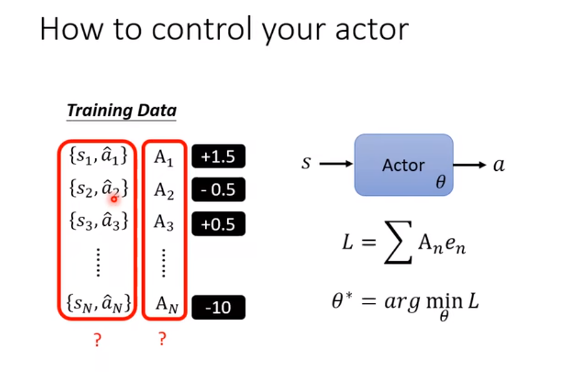
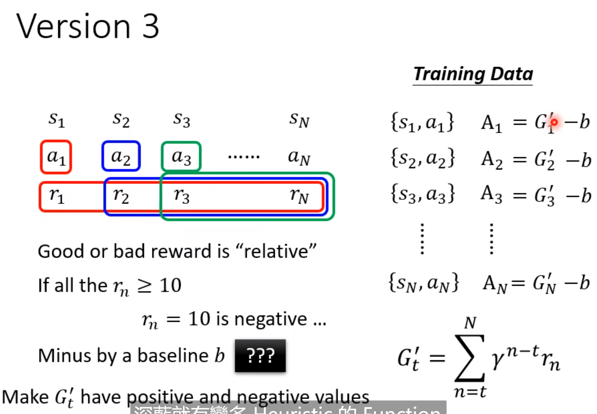
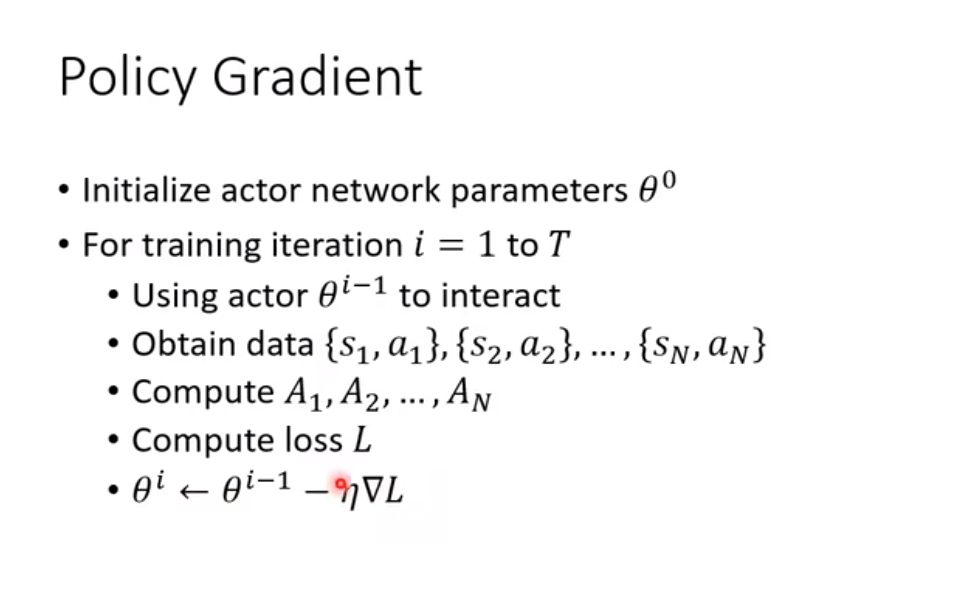
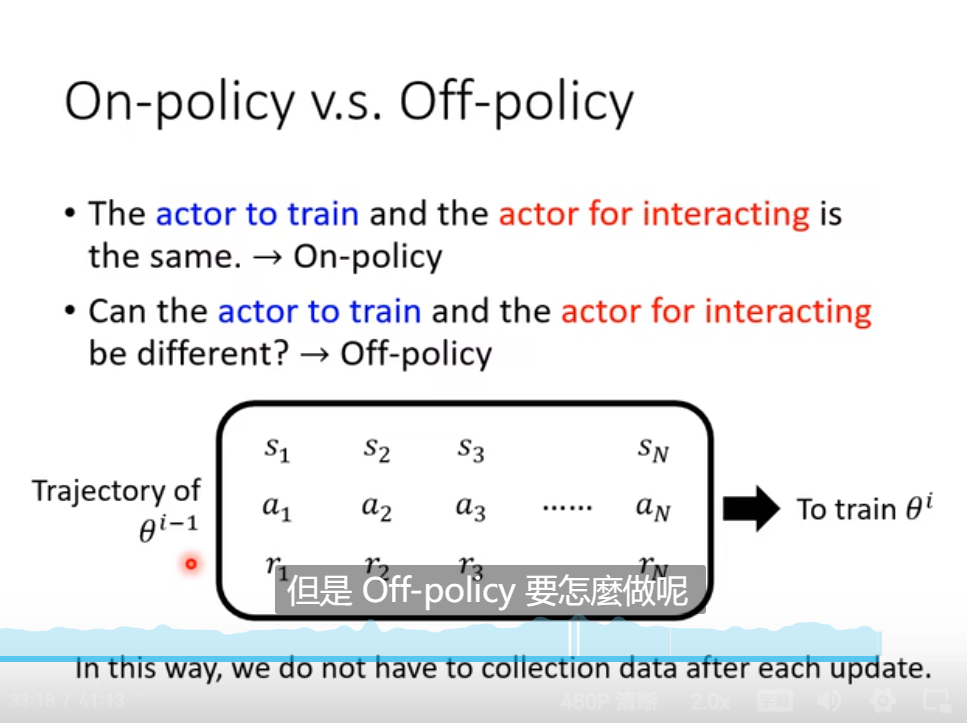
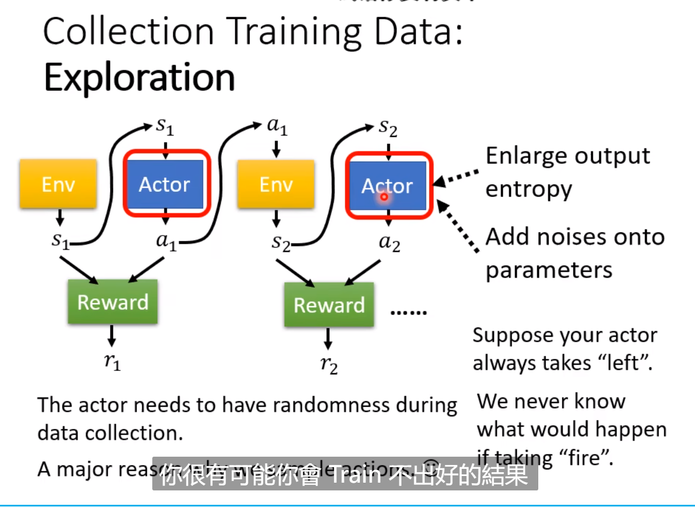
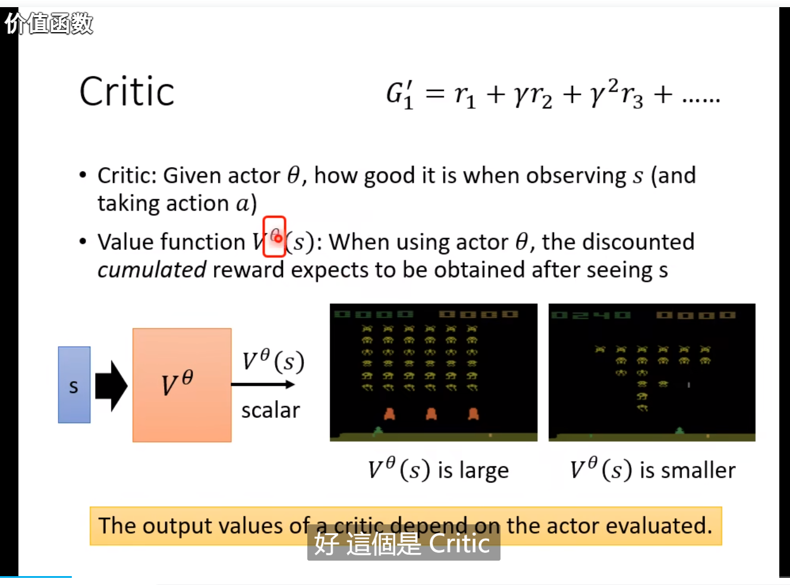

## [Task12] Lhy_ML_Reinforce_Learning

不知道正确答案是什么，收集的方式也很困难

和分类是一样的，输入可能是pixel，输出是action的prob。按照这个输出的机率去sample动作

输入是一串类似轨迹的东西，然后中间某些元素是Reward这个function的第t次输入，输出是第t次的得分，得分加起来的R(t)是要优化的目标。有点像RNN 的Loss。

challenge:

- actor输出会有**随机性**，输出每次都是不一样
- Env是一个黑盒子，有随机性，Reward不是Network? 
- 不是一般的optimization的问题

RL和GAN是有异曲同工之处的！ 

- actor可以比作generator, Env和reward就像是discriminator
- 不同点在于，GAN里面的discriminator是一个network，是可以解释的；但是reward是黑盒

关于这个训练的数据pair和A这个weight是我们要找寻的东西。这里的$e_n$指的是entropy

需要用累加和的方式来求action的reward，那个立马输出的reward不是最终的reward。$\gamma$是discount，会随时间衰减的！

收集数据需要在循环过程中不断收集，而不是一开始就定好的！

- on-policy: 和环境互动的actor和我们想要更新参数的actor是同一个
- off-policy: 互动的actor和更新参数的actor不是同一个，优点在于不需要更新一次资料才训练一次，而是能训练多次。和环境互动的actor，随机性应该要大一些比较好。（PPO）

需要增大actor的随机性，让它去学习尽可能多的可能，收集到尽可能丰富的数据

value function，目标是计算出discounted cumulated reward。和action是有关的！ 