## [Task14] Lhy_ML_Lifelong_Learning

> 我特别喜欢这个词，叫“终身学习”，我希望我也可以做到这样的一个境界！


**Q1: 终身学习的大致流程？**

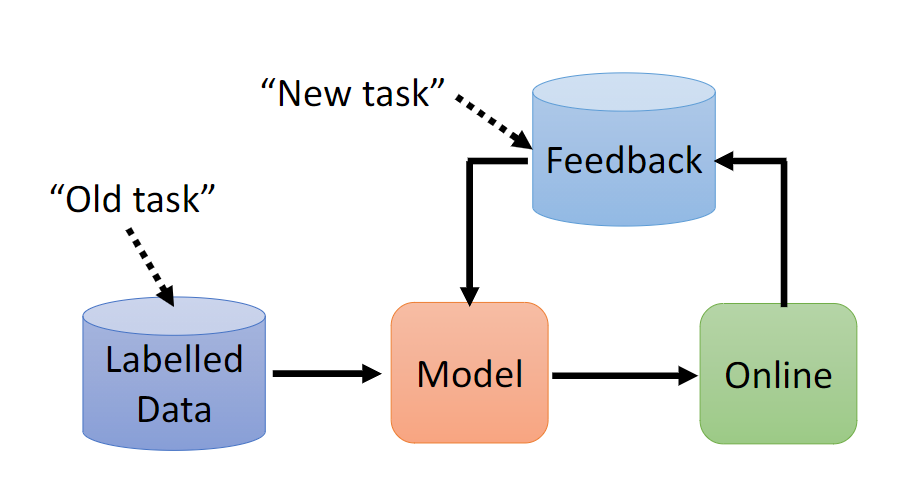

先从旧任务的标记数据中学习，然后使用线上的数据资料更新模型参数。


**Q2: 终身学习会遇到的问题——different domain, catastrophic forgetting, order(顺序)**

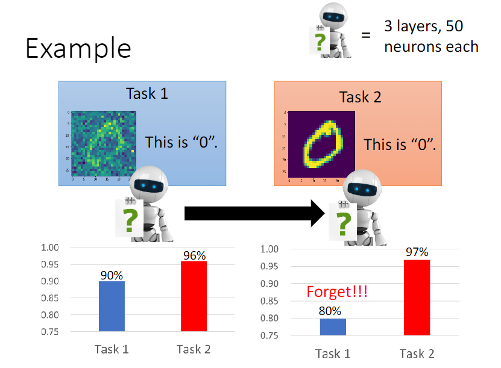

比如说这个，学了任务2之后，机器可能会遗忘了对任务1所学到的知识。


**Q3: 多任务学习（multi-task learning）和终身学习（lifelong）的区别？**

multi-task learning会把以前学到的东西，在新的阶段还拿出来，一块和新数据训练（相当于机器重新复习了），所以multi-task learning通常是LLL的upper bound。

如果全部倒在一起训练，这样十分**难以存储**，**训练时间长**。


**Q4: 终身学习（持续学习）的目的：**

不同任务间的资料互通有无（一个模型可以解决大多数的任务）

解决存储和训练时间的问题


**Q5: transfer learning 和 lifelong learning的区别**

- transfer注重于第一个任务学到的东西，对第二个任务有没有什么大的帮助（关注点在**第二个任务**）
- lifelong learning关注点在，学习完第二个任务之后再**回头看**第一个任务，还能不能有很好的解决效果？


**Q6: 对LLL的评估方式**

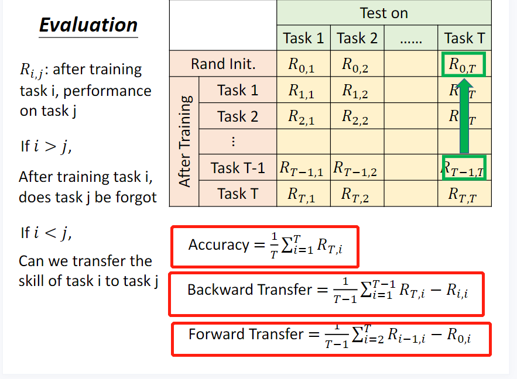


**Q7: 当前终身学习的3种解决方案**

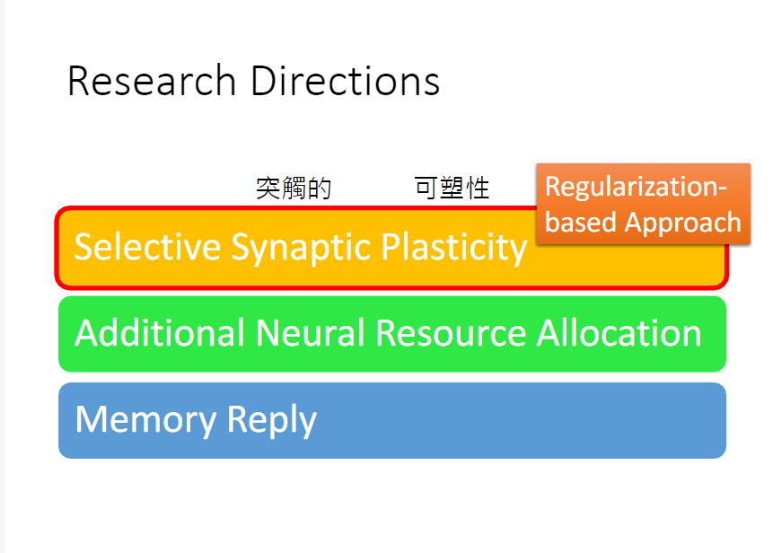


**Q8: 灾难性遗忘的原因**

不同的任务有不同的error surface

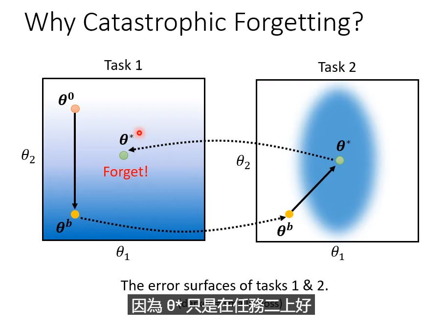


**Q9: regularization-based主要是在损失函数上怎么改进的？**

就是加了一个惩罚项，然后用$b_i$来衡量每一个参数的重要性，希望后面学的参数和前面学的参数尽量地接近（在某些参数上）   常见的是**人去设定**的$b_i$

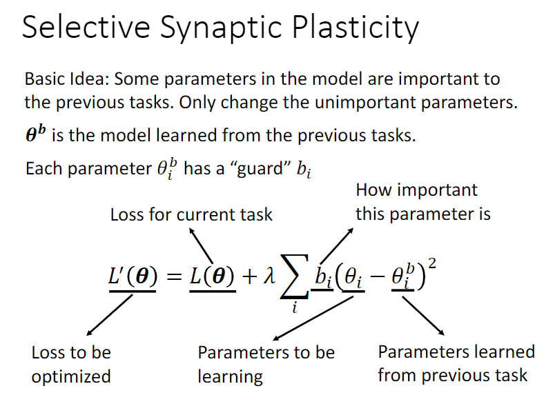


**Q10: $b_i$设置的两种极端会带来什么问题？**

- 如果希望各个任务之间互不影响，公式里面的$b_i$设置为0，那个就会有catastrophic forgetting的问题
- 如果$b_i$设置的很大，希望尽可能和之前学习的参数保持一样，就会有Intransigence的问题（对新的任务学不好）
- example:

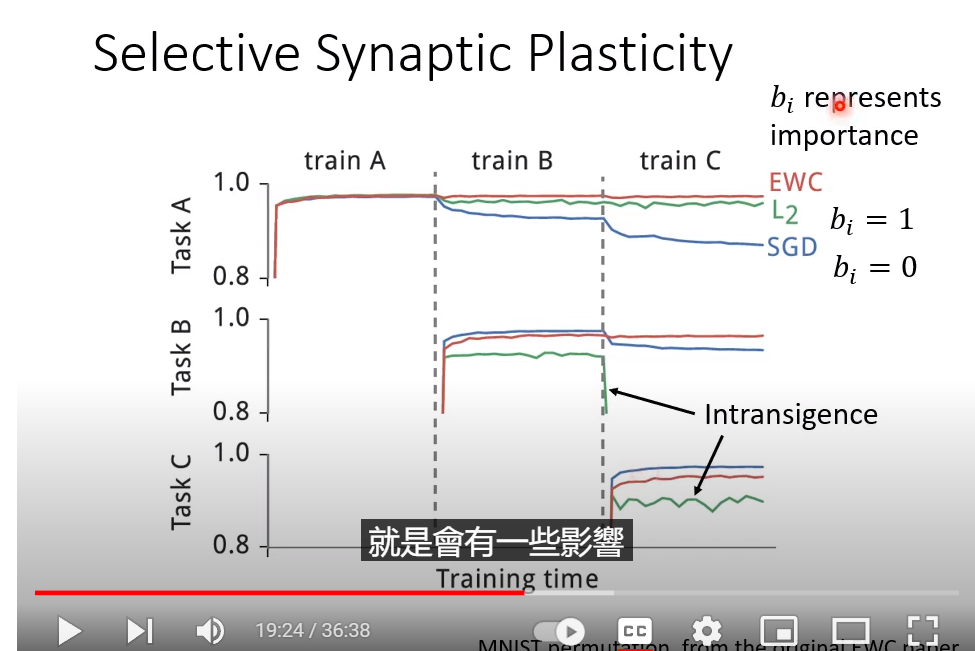


**Q11: 方法介绍（from homework）**

- **EWC**

  > Our approach remembers old tasks by selectively slowing down learning on the weights important for those tasks. 
  >
  > The mammalian brain may avoid catastrophic forgetting by protecting previously-acquired knowledge in neocortical circuits
  >
  > Slows down learning on certain weights based on how important they are to previously seen tasks
  >
  > and can therefore be imagined as a spring anchoring the parameters to the previous solution, hence the name **elastic**
  >
  > In the EWC algorithm, the definition of the loss function is shown below:
  >
  >  $$\mathcal{L}*_B = \mathcal{L}(\theta) + \sum_*{i} \frac{\lambda}{2} F*_i (\theta_*{i} - \theta_{A,i}^{*})^2  $$
  >
  > The definition of $F$ is shown below.
  >
  > $$ F = [ \nabla \log(p(y_n | x*_n, \theta_*{A}^{*})) \nabla \log(p(y_n | x*_n, \theta_*{A}^{*}))^T ] $$
  >
  > We only take the diagonal value of the matrix to approximate each parameter's $F_i$.

其实也就是用可导参数的一阶导数的平方，再做均值化，作为那个precision matrix中对应于这个可到参数的guard! 

这个EWC我不太会计算，但是我找到了一个学姐的博客！ 写的超级好！  要多多向学姐学习，搞好数学！

[Continual Learning 笔记: EWC / Online EWC / IS / MAS - 知乎 (zhihu.com)](https://zhuanlan.zhihu.com/p/205073566)

终于知道为什么EWC只取参数一阶导数的平方了，是因为泰勒展开后，因为有最大值，一阶导为0，那么考虑二阶导。二阶导需要减少计算开销，所以转成了Fisher信息矩阵，可以通过一阶导数的平方计算出来！

**注意**：EWC是需要labelled data的，因为需要求梯度！ 

> 我认为的另一个理解方式是，Fisher 信息矩阵也反映了我们对参数估计的不确定度。二阶导越大，说明我们对该参数的估计越确定，同时 Fisher 信息也越大，惩罚项就越大。于是越确定的参数在后面的任务里更新幅度就越小。


- **MAS**

> these importance weights approximate the sensitivity of the learned function to a parameter change rather than a measure of the (inverse of) parameter uncertainty
>
> Our goal is to preserve the prediction of the network (the learned function) at each observed data point and prevent changes to parameters that are important for this prediction.

```python
print(torch.norm(a, p=2) ** 2)
print(a.pow(2).sum())
# 这两个是一样的，但是因为EWC用的loss默认是mean，就是对所有样本做个mean，所以最好不要用norm那个吧，不然还要除以num_data（好像是一样的...）
# 反正dl答案是这样
"""
TODO
"""
        output_pow = output.pow(2) # 每个元素平方
        l2_norm_square = torch.sum(output_pow, dim=1).mean()
        l2_norm_square.backward()

        for n, p in self.model.named_parameters():
          # get the gradient of each parameter and square it, then average it in all validation set.
          precision_matrices[n].data += p.grad.data.abs() / num_data  # 注意了，这里用到绝对值！
```

这个方法的好处就在于，不需要使用到labelled data，而且可以从局部传播的角度进行参数传播和更新。


- SI

  > Each synapse accumulates task relevant information over time, and exploits this information to rapidly store new memories without forgetting old ones.
  >
  > Our importance measure can be computed efficiently and locally at each synapse during training, and represents the local contribution of each synapse to the change in the 
  >
  > 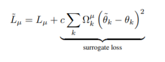
  >
  > 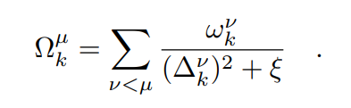
  >
  > 
  
  - 什么问题？：突触的复杂度。一维的突触会有灾难性遗忘，用三维空间可以解决。EWC limit了低维输出空间的应用 （???）
  - 解决了什么？创新点？： structural形式的改进，也就是让参数和旧任务的参数尽可能相似
  - 具体实施方式？
  
  计算每个参数对于Loss的贡献，然后得到关于某一个任务的该参数的惩罚系数。这个贡献在训练阶段是一直更新的，然后在这个任务训练完毕后，计算得到惩罚系数$\Omega$之后，这个贡献又被初始化为0.
  
  这个方式相对于EWC的优势在于，它的计算是online and along the entire learning trajectory的，而并非在一个seperate phase。个人理解是因为EWC需要最终的参数计算每个task的最终状态，而SI可以在过程中每个时间段都可以计算，因为那个$w_k^v$是在一直变化的。可能是叠加了中间过程的变化把！它可能是觉得EWC intractable? 

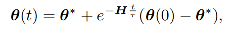

还是看这篇吧，我完全看不懂论文里面的推导...数学太差了[突触智能与人工神经网络的终身学习机制 - 知乎 (zhihu.com)](https://zhuanlan.zhihu.com/p/529527139)

```python
# SI的具体实现方式，但是这里好像完全没有考虑分类损失呀？ 只是对参数的改变做了个panelty而已
class si(object):
  def __init__(self, model, dataloader, epsilon, device):
    self.model = model
    self.dataloader = dataloader
    self.device = device
    self.epsilon = epsilon
    # extract all parameters in models
    self.params = {n: p for n, p in self.model.named_parameters() if p.requires_grad}

    self._n_p_prev, self._n_omega = self._calculate_importance()
    self.W, self.p_old = self._init_()


  def _init_(self):
    W = {}
    p_old = {}
    for n, p in self.model.named_parameters():
      n = n.replace('.', '__')
      if p.requires_grad: 
        W[n] = p.data.clone().zero_()  # 参数对loss的一个重要性！ 
        p_old[n] = p.data.clone()
    return W, p_old

  def _calculate_importance(self):
    n_p_prev = {}
    n_omega = {}

    if self.dataloader != None:
      for n, p in self.model.named_parameters():
        n = n.replace('.', '__')
        if p.requires_grad:
          # Find/calculate new values for quadratic penalty on parameters
          p_prev = getattr(self.model, '{}_SI_prev_task'.format(n))
          W = getattr(self.model, '{}_W'.format(n))
          p_current = p.detach().clone()
          p_change = p_current - p_prev
          omega_add = W/(p_change**2 + self.epsilon)
          try:
            omega = getattr(self.model, '{}_SI_omega'.format(n))
          except AttributeError:
            omega = p.detach().clone().zero_()
          omega_new = omega + omega_add   # 这个惩罚参数是一直累加的！
          n_omega[n] = omega_new
          n_p_prev[n] = p_current

          # Store these new values in the model
          self.model.register_buffer('{}_SI_prev_task'.format(n), p_current)  # 这个应该是某个参数，上一个任务的具体值
          self.model.register_buffer('{}_SI_omega'.format(n), omega_new)    # 这个是某个参数的惩罚系数

    else:  # 进行一个初始化
      for n, p in self.model.named_parameters():
        n = n.replace('.', '__')
        if p.requires_grad:
          n_p_prev[n] = p.detach().clone()
          n_omega[n] = p.detach().clone().zero_()
          self.model.register_buffer('{}_SI_prev_task'.format(n), p.detach().clone())
    return n_p_prev, n_omega

  def penalty(self, model: nn.Module):
    loss = 0.0  # 这个应该是不合理的，应该为具体的任务损失（分类损失等）
    for n, p in model.named_parameters():
      n = n.replace('.', '__')
      if p.requires_grad:
        prev_values = self._n_p_prev[n]
        omega = self._n_omega[n]
        _loss = omega * (p - prev_values) ** 2  # surrogate loss
        loss += _loss.sum()
    return loss

  def update(self, model):
    for n, p in model.named_parameters():
      n = n.replace('.', '__')
      if p.requires_grad:
        if p.grad is not None:
          self.W[n].add_(-p.grad * (p.detach() - self.p_old[n])) # 存储到原来的值中！ 反正这个就是个累加吧。按照那个积分公式来的（离散式）
          self.model.register_buffer('{}_W'.format(n), self.W[n])
        self.p_old[n] = p.detach().clone()
    return
```


- RWalk

> We present RWalk, a generalization of EWC++ (our efficient version of EWC ) and Path Integral with a theoretically grounded KL-divergence based perspective
>
> To compute and update the Fisher matrix, we use an **efficient (in terms of memory)** and **online (in terms of computation)** approach, leading to a faster and online version of EWC which we call EWC++.
>
> Next, we modify the PI [26] where instead of computing the change in the loss per unit distance in the Euclidean space between the parameters as the measure of sensitivity, we use the **approximate KL divergence** (distance in the Riemannian manifold) between the output distributions as the distance to compute the sensitivity
>
>  (3) strategies to obtain a few **representative samples** from the previous tasks. The first two components mitigate the effects of catastrophic forgetting, whereas the third handles intransigence.

第一个更有效率，说的应该是计算新的fisher矩阵的时候，用的是滑动平均的方式，而不需要每个任务全计算一次并且存储下来每个任务的fisher。

第二个， approximate KL 其实就是在EWC那个regularization的基础上加上一个关于参数对梯度的累计重要性的参数s

第三个，就是添加一个subset of previous tasks，文中讨论了4种采样方式： Uniform Sampling、Plane Distance-based Sampling、Entropy-based Sampling、Mean of Features (MoF)

Whole Loss:

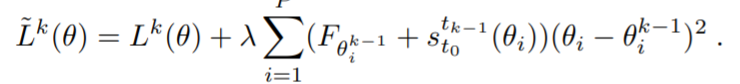

Updated Fisher: 

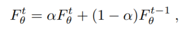

parameter importance:

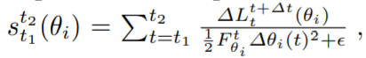

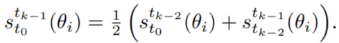


- SCP

> We propose the sliced Cramer distance as a suitable ´ choice for such preservation and evaluate our Sliced Cramer Preservation (SCP) ´ algorithm through extensive empirical investigations on various network architectures in both supervised and unsupervised learning settings.


```python
def sample_spherical(npoints, ndim=3):
  vec = np.random.randn(ndim, npoints)  # 默认抽出3个样本？
  vec /= np.linalg.norm(vec, axis=0)   # 正则化
  return torch.from_numpy(vec)

total_scalar = 0
for vec in L_vectors:
    scalar=torch.matmul(vec, mean_vec)
    total_scalar += scalar
    total_scalar /= L_vectors.shape[0]
    total_scalar.backward()
```

解释一下上面的代码，感觉就差不多了，还有那个L到底是个啥？


> ------
>
> ### Some thought
>
> 当看到自己的学长学姐都这么优秀的时候，我就会感觉目前自己的知识、经历、眼界是远远不足的。有的时候我可能会为一些小的荣誉沾沾自喜，但是在见识到优秀的前辈们如此脚踏实地，有着如此丰富的学识与经历却并未过度强调或过度追求那些所谓的奖项和荣誉时，我就会觉得受之有愧。
>
> Anyway，目前我的目标不仅在补好基础知识，还要大力减肥！！！:facepunch:
>
> :link:[LLL colab](https://colab.research.google.com/drive/1QzyvUSwa_8d93jJTONX4I6Pqn9E2ARYs#scrollTo=7OTZLwxrWFbL)

:date:6.25

本社恐人简直要疯掉了！！！      啊啊啊啊啊找点活干怎么就是要那么厚脸皮！！

Failed, 因为没有强化学习的经验所以师姐可能不会考虑带上我。所以下面估计要看一下强化学习方面的东西了！

:date: 6.26

唉，反正不能既要又要还要，我觉得我还是先多多积累论文方法？ 论文语言。论文思路     然后为后续的投稿准备一下吧！ 对不起对不起对不起对不起对不起


