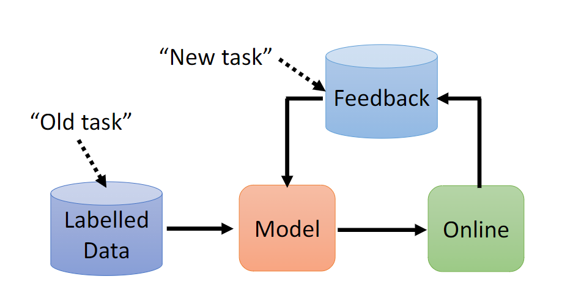
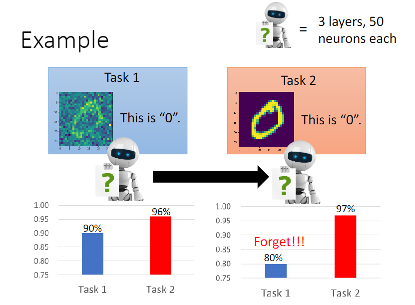
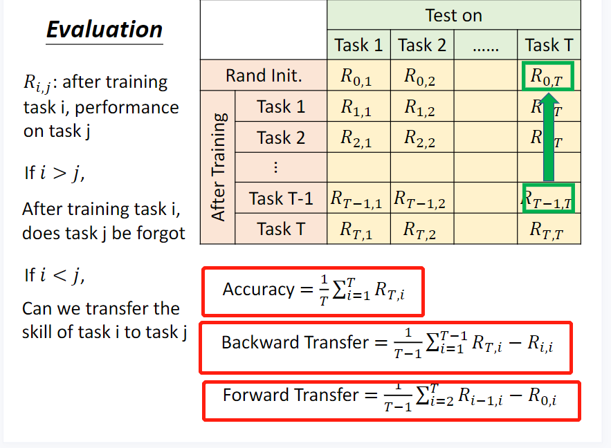
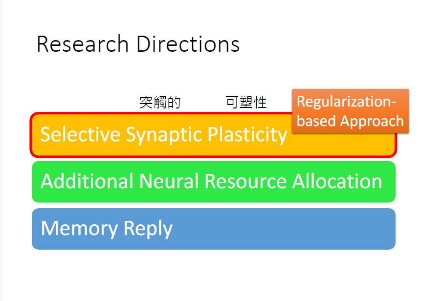
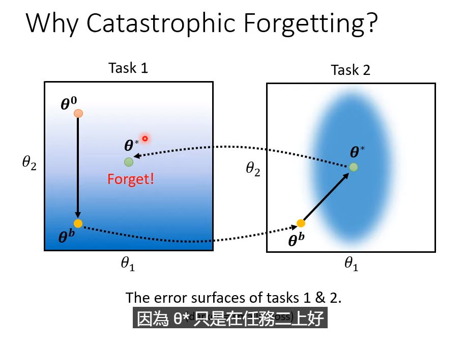
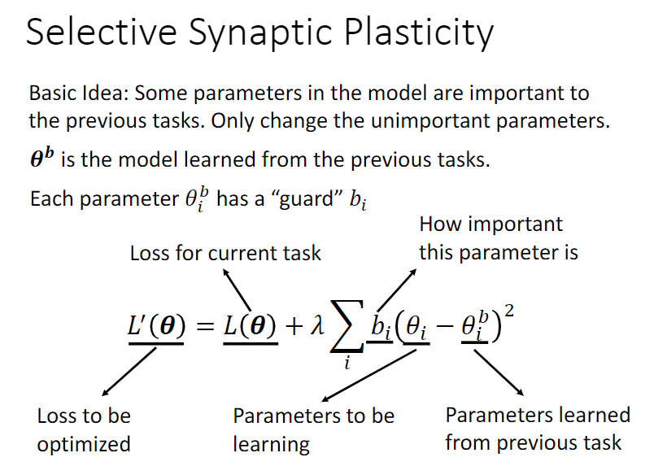
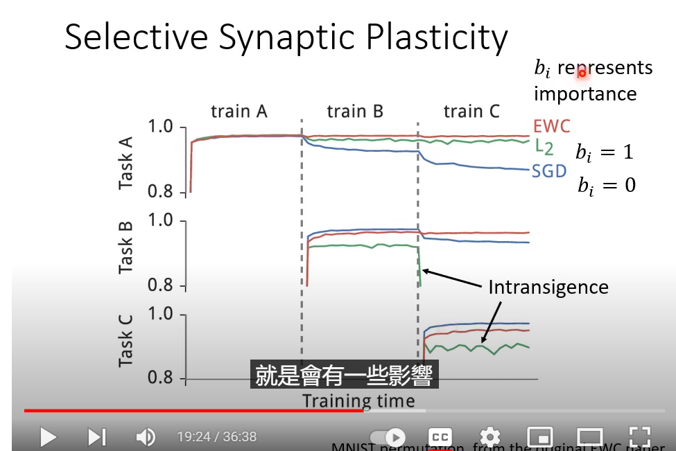

## [Task14] Lhy_ML_Lifelong_Learning

> 我特别喜欢这个词，叫“终身学习”，我希望我也可以做到这样的一个境界！

**Q1: 终身学习的大致流程？**

先从旧任务的标记数据中学习，然后使用线上的数据资料更新模型参数。

**Q2: 终身学习会遇到的问题——different domain, catastrophic forgetting, order(顺序)**

比如说这个，学了任务2之后，机器可能会遗忘了对任务1所学到的知识。

**Q3: 多任务学习（multi-task learning）和终身学习（lifelong）的区别？**

multi-task learning会把以前学到的东西，在新的阶段还拿出来，一块和新数据训练（相当于机器重新复习了），所以multi-task learning通常是LLL的upper bound。

如果全部倒在一起训练，这样十分**难以存储**，**训练时间长**。

**Q4: 终身学习（持续学习）的目的：**

不同任务间的资料互通有无（一个模型可以解决大多数的任务）

解决存储和训练时间的问题

**Q5: transfer learning 和 lifelong learning的区别**

- transfer注重于第一个任务学到的东西，对第二个任务有没有什么大的帮助（关注点在**第二个任务**）
- lifelong learning关注点在，学习完第二个任务之后再**回头看**第一个任务，还能不能有很好的解决效果？

**Q6: 对LLL的评估方式**

**Q7: 当前终身学习的3种解决方案**

**Q8: 灾难性遗忘的原因**

不同的任务有不同的error surface

**Q9: regularization-based主要是在损失函数上怎么改进的？**

就是加了一个惩罚项，然后用$b_i$来衡量每一个参数的重要性，希望后面学的参数和前面学的参数尽量地接近（在某些参数上）   常见的是**人去设定**的$b_i$

**Q10: $b_i$设置的两种极端会带来什么问题？**

- 如果希望各个任务之间互不影响，公式里面的$b_i$设置为0，那个就会有catastrophic forgetting的问题
- 如果$b_i$设置的很大，希望尽可能和之前学习的参数保持一样，就会有Intransigence的问题（对新的任务学不好）
- example:

**Q11: 方法介绍**

- EWC

  > Our approach remembers old tasks by selectively slowing down learning on the weights important for those tasks. 
  >
  > The mammalian brain may avoid catastrophic forgetting by protecting previously-acquired knowledge in neocortical circuits
  >
  > Slows down learning on certain weights based on how important they are to previously seen tasks
  >
  > and can therefore be imagined as a spring anchoring the parameters to the previous solution, hence the name **elastic**
  >
  > In the EWC algorithm, the definition of the loss function is shown below:
  >
  >  $$\mathcal{L}*_B = \mathcal{L}(\theta) + \sum_*{i} \frac{\lambda}{2} F*_i (\theta_*{i} - \theta_{A,i}^{*})^2  $$
  >
  > The definition of $F$ is shown below.
  >
  > $$ F = [ \nabla \log(p(y_n | x*_n, \theta_*{A}^{*})) \nabla \log(p(y_n | x*_n, \theta_*{A}^{*}))^T ] $$
  >
  > We only take the diagonal value of the matrix to approximate each parameter's $F_i$.

其实也就是用可导参数的一阶导数的平方，再做均值化，作为那个precision matrix中对应于这个可到参数的guard! 