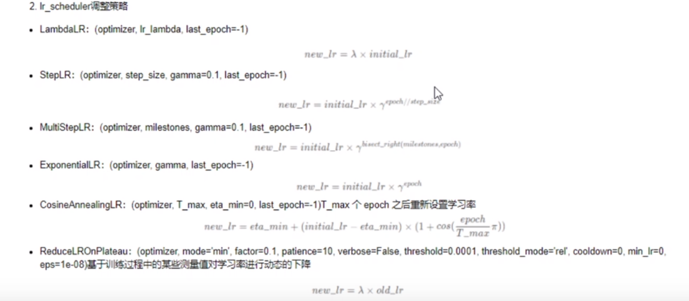

# Optimizer summary

[TOC]

## optimizer

### General

```python
# 取出未冻结的层
    param_update= []
    for param in model.parameters():
        if param.requires_grad:
            param_update.append(param)
    
    # 定义优化器
    optimizer = torch.optim.AdamW(param_update, lr=args.lr, weight_decay=args.weight_decay)  # 放入更新的参数，学习率和wd
```


### param_group

网络不同层/块使用不同的学习率参数，层级的学习率衰减。

```python
    # from MKT
    params, param_group_names = lrd.param_groups_lrd(model, args.fix_layer, args.weight_decay,
        layer_decay=args.layer_decay
    )  # 设定固定的层数，还有一个固定的weight_decay
    params_name = []
    for k, v in param_group_names.items():
        params_name += v["params"]
    optimizer = torch.optim.AdamW(params, lr=args.lr)  # 优化器主要是adamW

    for name, param in model.named_parameters():
        if name not in params_name:
            param.requires_grad = False

```

```python
def param_groups_lrd(model, fix_layer, weight_decay=0.05, no_weight_decay_list=[], layer_decay=.75):
    """
    Parameter groups for layer-wise lr decay
    Following BEiT: https://github.com/microsoft/unilm/blob/master/beit/optim_factory.py#L58
    """
    param_group_names = {}
    param_groups = {}  

    if hasattr(model, "blocks"):  # CNN类
        num_layers = len(model.blocks) + 1
    elif hasattr(model, "transformer"):  # ViT类
        num_layers = model.transformer.layers + 1
    else:
        num_layers = len(model.blocks) + 1

        """
        from gpt: 使用指数衰减函数计算每一层衰减比例，衰减比例按从最后一层到第一层的顺序降低（指数越大值越小）
        """
    layer_scales = list(layer_decay ** (num_layers - i) for i in range(num_layers + 1))  # 这个比较重要，但我不知道为什么它这样安排

    for n, p in model.named_parameters():
        if not p.requires_grad:
            continue

        # no decay: all 1D parameters and model specific ones
        if p.ndim == 1 or n in no_weight_decay_list:
            g_decay = "no_decay"
            this_decay = 0.
        else:
            g_decay = "decay"
            this_decay = weight_decay
        # import pdb; pdb.set_trace()
        if hasattr(model, "blocks"):
            layer_id = get_layer_id_for_vit(n, num_layers)
        else:
            layer_id = get_layer_id_for_clip(n, num_layers)

        if layer_id > fix_layer:

            group_name = "layer_%d_%s" % (layer_id, g_decay)

            """
            如果group_name在参数组字典param_group_names中不存在，则创建一个新的参数组，并将参数的学习率比例this_scale、权重衰减this_decay和参数列表params添加到参数组字典中。
            """
            if group_name not in param_group_names:
                this_scale = layer_scales[layer_id]
				
                param_group_names[group_name] = {
                    "lr_scale": this_scale,  #  pg["lr"] = lr_scale * self.learning_rate
                    "weight_decay": this_decay,
                    "params": [],
                }
                param_groups[group_name] = {
                    "lr_scale": this_scale,
                    "weight_decay": this_decay,
                    "params": [],
                }

            param_group_names[group_name]["params"].append(n) # 只是放name e.g projection_dist
            param_groups[group_name]["params"].append(p)

    return list(param_groups.values()), param_group_names
```


------


## Scheduler

> 学习率调度器用于在训练神经网络模型时动态地调整学习率的数值。学习率调度器根据预定义的规则和模式，根据训练的进程或时间来动态地调整学习率。常见的调度模式包括线性衰减、余弦衰减等。例如，在训练初期可以使用较大的学习率来快速进行参数更新，然后随着训练的进行逐渐降低学习率，使得参数更新变得更加精细，以获得更好的模型性能。
>
> 学习率调度器通常与优化器配合使用，优化器用于更新模型的参数，而学习率调度器用于控制优化器中的学习率。通过在训练过程中适时地调整学习率，可以使模型更加准确地找到损失函数的最优解，从而提高模型的训练效果和性能。

### Linear/cosine/cosine_pi

```python
def create_scheduler(
    cfg: SchedulerConf,
    optimizer: optim.Optimizer,
    num_steps: int,
):
    T = cfg.cycle if cfg.cycle > 0 else num_steps
    s_min = cfg.scale_min
    scale = lambda r: r * (1 - s_min) + s_min
    if cfg.mode == "cosine_pi":  # 0 -> T => 0 -> pi
        lr_lambda = lambda t: scale(0.5 + 0.5 * cos(t / T * pi))
    elif cfg.mode == "cosine":  # 0 -> T => 0 -> 0.5*pi
        lr_lambda = lambda t: scale(cos(t / T * pi / 2))
    else:  # default is linear
        lr_lambda = lambda t: scale(1 - t / T)
    return optim.lr_scheduler.LambdaLR(optimizer, lr_lambda=lr_lambda)
```

调度器更新应该放在学习率更新之后

```python
scheduler = ...
for epoch in range(100):
     train(...)
     validate(...)
     scheduler.step()
        
        
for epoch in range(1, 11):
    # train
    optimizer_1.zero_grad()
    optimizer_1.step()
    print("第%d个epoch的学习率：%f" % (epoch, optimizer_1.param_groups[0]['lr']))
    scheduler_1.step()
```



