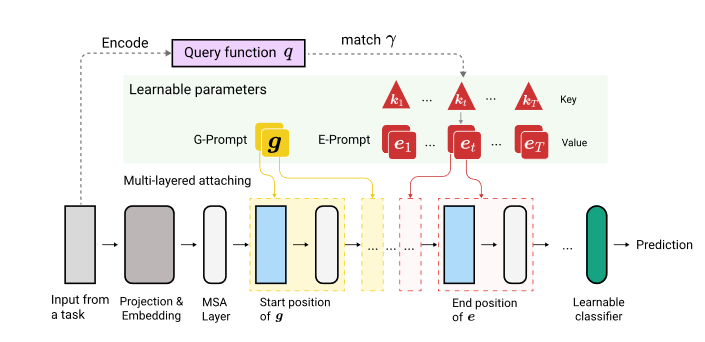
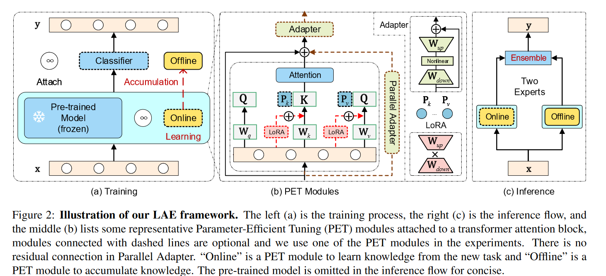

# Summary for continual&lifelong learning

[TOC]

### Paper list

**Survey**

- *Three scenarios for continual learning*
- *A Comprehensive Survey of Continual Learning: Theory, Method and Application*
- *Deep Class-Incremental Learning: A Survey*

**Classic**

- *iCaRL: Incremental Classifier and Representation Learning*
- *Gradient Episodic Memory for Continual Learning*
- *Efficient Lifelong Learning with A-GEM*
- *DER: Dynamically Expandable Representation for Class Incremental Learning*
- *李宏毅机器学习2022  lifelong learning*

**Pre-trained**

- *DyTox: Transformers for Continual Learning with DYnamic TOken eXpansion*
- *ELLE: Efficient Lifelong Pre-training for Emerging Data*
- *A Unified Continual Learning Framework with General Parameter-Efficient Tuning*
- *Revisiting a kNN-based Image Classification System with High-capacity Storage*
- *Revisiting Class-Incremental Learning with Pre-Trained Models: Generalizability and Adaptivity are All You Need*

**Prompt-based**

- *S-Prompts Learning with Pre-trained Transformers: An Occam's Razor for Domain Incremental Learning*
- *Learning to Prompt for Continual Learning*
- *DualPrompt: Complementary Prompting for Rehearsal-free Continual Learning*

### Definition

持续/终身学习（下面简称持续学习）就是让模型从连续信息流中学习的一种方法，就是训练数据不会一次性提供，而是会一批一批按照顺序提供，让模型渐进式地学习且适应这些数据。

在持续学习中需要注意两方面的问题：

- 把之前学到的知识拓展到新任务/新数据上，也就是**对新知识学的好 **  --> 可塑性

- 保持对于旧任务的学习能力，也就是**不忘记旧知识**    ---> 稳定性

  

👉**continual learning vs. incremental learning vs. lifelong learning**

三者如果不作严格区分的话，在论文里面其实意思是一致的，均可通用。

> valse webinar: 
>
> - Incremental: 学了新东西不要忘了旧东西（Task- Domain- Class-）。
> - Continual/Lifelong: 可能会比incremental有更高的诉求，比如说要求对后面任务也能学习的更好（zero-shot能力），或者说学了后面的任务后，对以前的任务也能有所提升。
>
> 如果只是类别和任务的增加，用incremental表示更合适；但如果是数据增加，不涉及类别任务的增加，可能更偏向于continual/lifelong。
>
> 所以说continual learning其实是涵盖更广的一个范围，lifelong和continual的含义几乎一致。

然而，在paper with code这个网站上，incremental的范围会更广，continual learning单指task-CL，即测试时提供task ID，这种setting会比较简单。

**👉continual learning vs. transfer learning**

从目的上来说，前者指在新旧的任务上都希望能够表现得很好；后者仅希望是应用前面的知识，使得当前任务表现得更好。

### Challenge

from *A Comprehensive Survey of Continual Learning: Theory, Method and Application*

- **Catastrophy forgetting ( main )** (have no stability)
- **Intransigence** (have no plasticity)
- **resource efficiency**: 不可以用太多空间，把所有的之前的数据全部存起来

🎯**goal**: good **generalizability** within and between task。需要在stability和plasticity中做一个trade-off，而且还要考虑资源的利用和限制。

### Scenario

from *Three scenarios for continual learning*

最有挑战性的是class-IL，也就是说需要模型识别从开始训练到当前任务遇到的所有class，不区分这个class是哪个task提供的，而且大家似乎都愿意往class-IL的方向去做~ 

然后下面主要介绍的还是**class-IL**这个方面的吧，因为难度最大且相关工作比较多。

### 📚Method

#### 💡Train from scratch

from *Deep Class-Incremental Learning: A Survey*

##### 1. Data-Centric

- **Direct replay**

  都习惯于用一种叫Rehearsal的方式，存一些之前任务的示例样本到memory buffer中，便于今后任务的回顾。

  > *Rehearsal aims to approximate the observed input distributions over time and later resamples from this approximation to avoid forgetting.*

  - ER( Experience Replay )：直接从旧任务的数据中均匀采样，放到memory buffer中。或者采样离feature center最近的一些examplar放进去，然后和当前任务的数据一起训练。
  - iCaRL: 用**栈**式的思想，动态更新exampler sets，限制了内存的增长。loss进行了改进，对旧任务的exampler数据用distillation的思想（soft targets），对新任务的实际数据用hard target。

- **Generative Replay**

  会在分类模型之外额外构建一个生成模型，用于学习前后任务的数据分布。但是生成模型同时也会遭受灾难遗忘的问题，反过来又会继续加重分类模型灾难遗忘问题。生成的质量如何保证？

  - GR: 用GAN或者VAE进行伪样本生成，但是每个任务都有一个求解器，需要存这个求解器的参数。
  - FearNet：双记忆系统，分为长期记忆和短期记忆。

- **Data regulization**

  用数据的形态控制优化方向，也是取一定的旧数据放在memory buffer里面，然后计算一下新旧数据梯度，希望对新数据梯度更新的方向进行约束

  

  - GEM & A-GEM: GEM就是满足一个模型在新旧数据上的梯度方向成锐角或直角这个公式就好，缺陷就是每一个训练完的task都要重新计算一遍对于旧任务数据的梯度，不高效。需要保存以前所有任务的gradient。

    

    A-GEM加速了优化过程，不用再和以前每一个任务的梯度一一作比较，只需要对旧任务的sample进行任意选择保存，然后在当前task上对这些sample求梯度，拿这个梯度当成旧任务梯度就行。

##### 2. Model-Centric

- **Dynamic network**(表现力最强)

  主要思想就是对网络的结构进行拓展，按照新加进来的任务，添加一些新的结构或backbone。

  

  

  - DER: 每添加一个新的任务，就增加一个backbone（一般是ResNet18）

  - FOSTER： 训练过程中，内存最多只维持2个backbone，一个是先前任务总的backbone（保存旧知识），一个是新任务的backbone（学习的是更具判别性的新类知识），然后再把两个backbone的知识融合在一个backbone里面，做一个model compression。

  - MEMO：保持模型浅层的特征知识共享，末层随着类别的增加而增加（末层更具有判别性和多样性）。

  - TCIL（CIFAR100  SOTA）

    

    延续了DER的思想，每个新Task增加一个feature extractor。用了特征蒸馏和logits蒸馏，对于增加得过大的模型，提出剪枝方式，为TCIL-lite。

- **Parameter regularization**

  根据模型参数对任务的贡献度，对参数更新的方式进行了限制。但是这类方式的表现能力已经远不如动态网络的方式了。

  - EWC: 通过计算fisher信息矩阵，获取每个参数对先前任务的重要程度，对于贡献度大的参数来说，对其更新所施加的惩罚也更大。

    

    

##### 3. Algorithm-Centric

（和上面两种方式的界限不是特别的明显，甚至可以和model-centric融合）

- LwF （知识蒸馏，自蒸馏，旧任务蒸馏到新任务）
- BiC（矫正对新任务的偏好，用验证集（从训练集中分出来的）去矫正输出的bias，和预训练方式中的SSF有点像）

##### 4. Discussion for training-from-scratch method

- 数据集：用的最多的都是CIFAR100、ImageNet100、ImageNet1000这种，算是比较小的，因为是train from scratch的。
- Dynamic Network的方法还是**占据着表现力主导地位**的
- 用预训练的方式来和这些方法对比实际上是**不公平**的（除非它们的backbone也使用预训练的方式），原因：
  - 这些模型是从头开始训练，挑战难度会更大
  - 预训练的数据集与实际训练和测试的数据集可能会有大量重合，导致其性能远高于这种scratch的模型。
  - 当给足够的空间资源时，动态网络是能够表现出很好的作用。但当资源限制时，就不一定能表现出最好的能力。因此需要做一个memory-agnostic的对比。文中提出的AUC-A和AUC-L是很好地选择。

------

#### 💡Pre-trained

##### 1. Prompt-based

和rehearsal-based的方式比较，prompt-based就是不需要exampler去记录过去的类别，而是用一些特定的prompt来代表每一个任务。主要思想是，prompt由几个token组成，是可调的，但是image token是不可调的。预训练模型大多数固定，有时候也可略微调整（DyTox）

- DyTox: 第一篇在continual learning中用ViT的文章（CVPR2022）每个task，制定一个独立的token和专属分类器（加起来的参数和整个预训练模型相比是很少的）。推理的时候，每个任务的token都将加到image token上（相当于原来的class token），然后送到token专属分类器里面进行分类。

- L2P：有一个prompt pool，里面是key-value paired，并且是**固定数量**的。input通过预训练模型提取得到query，然后匹配从prompt pool里面提取几个Token作为可训练的prompt，直接加入到image embedding前面（当作class token）进行训练。最后根据这个prompt对应的token，做平均得到预测类别。文章默认了这个prompt池里面的prompt**既可以学习到共享知识，也能学到独立的知识**。但文章还是用了一些rehearsal的方式，来和有buffer size的方法进行比较。文章没有说具体回放形式，应该是随机采样。

  

- Dual-Prompt：强调是**rehearsal-free**的方式，并且把L2P里面的prompt pool进行了**解耦**。G-Prompt用来学习底层的，共享的特征，E-Prompt来处理比较高层的，具有判别性的特征。而且这些prompt插入的层不一样，G-Prompt主要插入在前两层，而E-Prompt插入在3-5层表现最好。G-Prompt长度5最好，E-Prompt长度20最好。

  

  

  

- S-Prompt：和DyTox有点像，但这个是每一个**域**对应于一个（或几个）image token和一个tunable text prefix token，仅仅对域token和末端分类器进行微调。推理的时候用KNN选取距离图像特征最近的域特征中心（K-Means选出的）对应的Prompt。然后像CLIP那样进行相似度匹配。

  

  

##### 2. Parameter-efficient tuning

- ADAM (Adapt and merge)    好像投稿没中，可能创新性还不足？

  

  

  - Model adaptation: 用PET的方式，获得一个adapted model，同时保持原来的pretrained model。PET方式包括VPT、Scale&Shift（SSF）、Adapter还有Batch Normalization Tuning。
  - Merge with pre-trained：直接出来一个预训练的特征，然后和上面adapted model的adaptive特征concat在一起。

- LAE (ICCV2023)

  

  用了Adapter、LoRA和Prefix tuning三种PET方式，还有3种创新设计：

  - 校准不同PET模块（Adapter、LoRA、PF）的更新速度，让它们的适配速度与Adapter的保持一致
  - 多任务知识聚合：也就是用online-PET模块，使用指数移动平均的方式更新offline-PET的参数
  - 预测的时候，集成online-PET和offline-PET的energy，使用的是max函数。

##### 3. Other

- **ELLE**: model expansion的思想，是NLP领域的，针对的是Transformer的结构调整

模型的宽度和深度都扩展了，通过了一个function recover的方式，来在扩张的模型上保持原有模型的功能。深度扩充就是把中间的一些层复制多一份，宽度扩充就是把中间的weight矩阵加宽。而且还添加了预训练的domain prompt，来告诉它处于哪个领域。

##### 4. Discussion for pre-trained-method

-  **combine with Neuroscience knowledge**：在introduction部分，有很多的from scratch文章是结合生物学思想的，比如说突触、海马体.... pre-trained文章里面我看好像只有dual prompt那篇文章用了这个想法，其它的都是直接从模型方面缺陷入手改进的。
- **transformer的decoder是否可以用来做generative的replay?**  ：用generative和replay的那种思想，因为当前的pre-trained的方式全都是model-centric，较少有data-centric的
- **more challenging benchmark**: 在**更具挑战性的benchmark**上进行实验，而非那种from scratch的小实验。ADAM那篇文章里面提出了4个更具挑战性的benchmark，但在这些数据集上跑的方法比较少。

