## 失踪人口回归之continual/lifelong learning presentation draft

> *前言：这段时间失踪是因为看了10+的traditional/pre-trained系列的连续学习/终身学习方面的文章，虽然是摆烂着看的，但也还是咬着牙看完了。基于下周要做的一个组会PPT，在这里先做一下文字版的解读。虽然我还是没有读懂一个baseline的代码，以及把毕设的promote工作拖延了很久。。。 搞完这个PPT咱们就去研究毕设的incremental工作~*

### Definition

持续/终身学习（下面简称持续学习）就是让模型从连续信息流中学习的一种方法，就是训练数据不会一次性提供，而是会一批一批按照顺序提供，让模型渐进式地学习且适应这些数据。

在持续学习中需要注意两方面的问题：

- 把之前学到的知识拓展到新任务/新数据上，也就是**对新知识学的好 **  --> 可塑性

- 保持对于旧任务的学习能力，也就是**不忘记旧知识**    ---> 稳定性

  

👉**continual learning vs. incremental learning vs. lifelong learning**

三者如果不作严格区分的话，在论文里面其实意思是一致的，均可通用

> valse webinar: （重复再看一遍，领会一下）
>
> - IL: 学了新东西不要忘了旧东西（Task- Domain- Class-）
> - LL: 增量学习过程有前向的传播，学了前面，对后面更好的（融会贯通）  和continual learning更像  更好地extend   从人的角度！ 
>
> 如果只是类别和任务什么的增加，可能是增量学习；但如果是数据增加，可能更偏向于终身学习。
>
> 所以说continual learning其实是涵盖更广的一个范围，lifelong和continual的含义几乎一致。

然而，在paperwithcode这个网站上，incremental的范围会更广，continual learning单指task-CL，即测试时提供task ID，这种setting会比较简单。

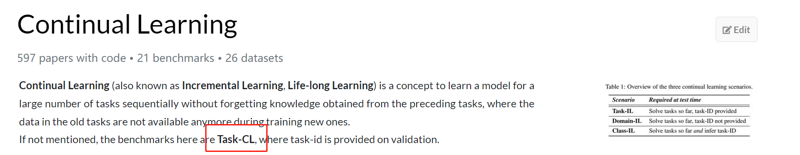

**👉continual learning vs. transfer learning**

从目的上来说，前者指在新旧的任务上都希望能够表现得很好，后者仅希望是应用前面的知识，使得当前任务表现得更好。

### Challenge

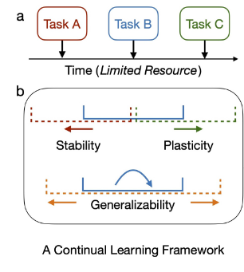

- **Catastrophy forgetting ( main )** (have no stability)
- **Intransigence** (have no plasticity)
- **resource efficiency**: 不可以用太多空间，把所有的之前的数据全部存起来

🎯**goal**: good **generalizability** within and between task。需要在stability和plasticity中做一个trade-off，而且还要考虑资源的利用和限制。

### Scenario

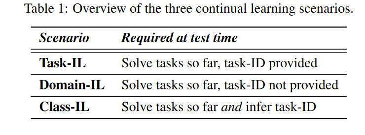

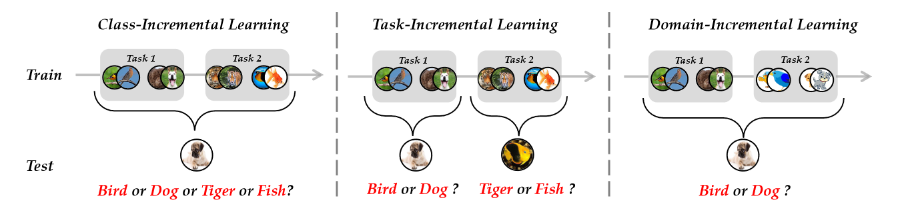

最有挑战性的是class-IL，而且大家似乎都愿意往class-IL的方向去做~ 

然后下面主要介绍的还是**class-IL**这个方面的吧，因为难度最大且相关工作比较多。

### 📚Method

#### 💡Train from scratch (Deep class-incre survey)

##### 1. Data-Centric

- **Direct replay**

  都习惯于用一种叫Rehearsal的方式，存一些之前任务的示例样本到memory buffer中，便于今后任务的回顾。

  > *Rehearsal aims to approximate the observed input distributions over time and later resamples from this approximation to avoid forgetting.*

  - ER( Experience Replay )：直接从旧任务的数据中均匀采样，放到memory buffer中。或者采样离feature center最近的一些examplar放进去，然后和当前任务的数据一起训练。
  - iCaRL: 用**栈**式的思想，动态更新exampler sets，限制了内存的增长。loss进行了改进，对旧任务的exampler数据用distillation的思想（soft targets），对新任务的实际数据用hard target。

- **Generative Replay**

  会在分类模型之外额外构建一个生成模型，用于学习前后任务的数据分布。但是生成模型同时也会遭受灾难遗忘的问题，反过来又会继续加重分类模型灾难遗忘问题。生成的质量如何保证？

  - 用GAN或者VAE进行伪样本生成（GR、...）但是每学习一个任务就要有一个scholar? 每个任务都有一个求解器
  - FearNet，双记忆系统，分为长期记忆和短期记忆

- **Data regulization**

  用数据的形态控制优化方向，也是取一定的旧数据放在memory buffer里面，然后计算一下新旧数据梯度，希望对新数据梯度更新的方向进行约束

  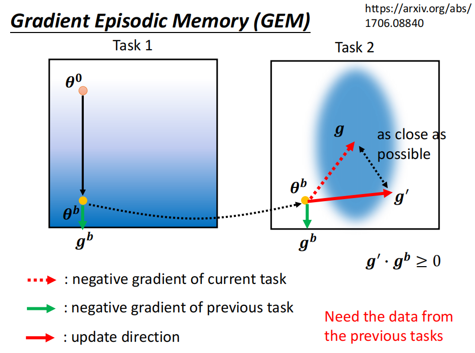

  - GEM & A-GEM: GEM就是满足一个模型在新旧数据上的梯度方向成锐角或直角这个公式就好，缺陷就是每一个训练完的task都要重新计算一遍对于旧任务数据的梯度，不高效。需要保存以前所有任务的gradient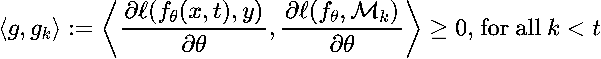

    A-GEM加速了优化过程，不用再和以前每一个任务的梯度一一作比较，只需要对旧任务的sample进行任意选择保存，然后在当前task上对这些sample求梯度，拿这个梯度当成旧任务梯度就行。

##### 2. Model-Centric

- **Dynamic network**(表现力最强)

  主要思想就是对网络的结构进行拓展，按照新加进来的任务，添加一些新的结构。

  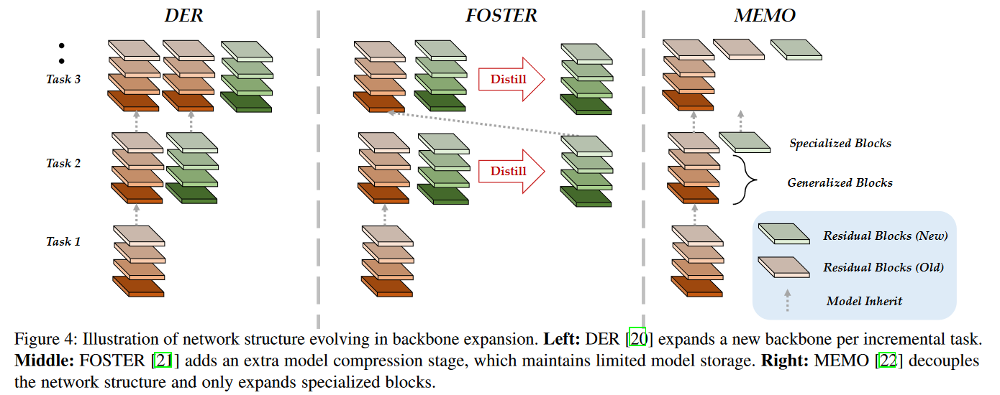

  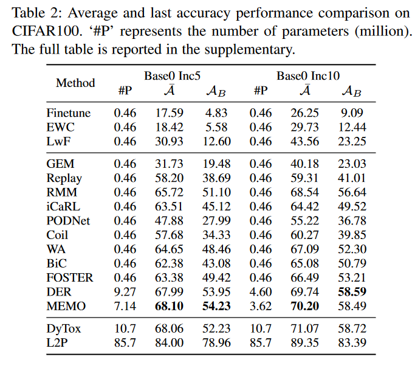

  - DER: 每添加一个新的任务，就增加一个backbone（一般是ResNet18）

  - FOSTER： 训练过程中，内存最多只维持2个backbone，一个是先前任务总的backbone，一个是新任务的backbone，然后再把两个backbone的知识融合在一个backbone里面，做一个model compression。新backbone学习的是更具判别性的关于新类的知识。

  - MEMO：保持模型浅层的特征知识共享，末层随着类别的增加而增加（末层更具有判别性和多样性）。

  - TCIL

    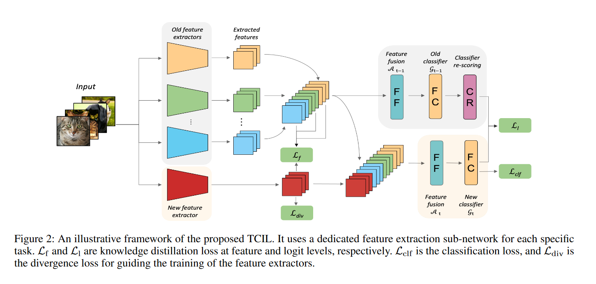

    延续了DER的思想，每个新Task增加一个feature extractor。用了特征蒸馏和logits蒸馏，对于过大的模型，提出剪枝方式，为TCIL-lite。

- **Parameter regularization**

  根据模型参数对任务的贡献度，对参数更新的方式进行了限制。但是这类方式的表现能力已经远不如动态网络的方式了。

  - EWC: 通过计算fisher信息矩阵，获取每个参数对先前任务的重要程度，对于贡献度大的参数来说，对其更新所施加的惩罚也更大。

    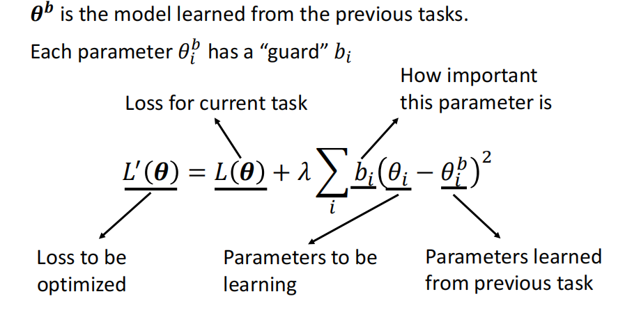

    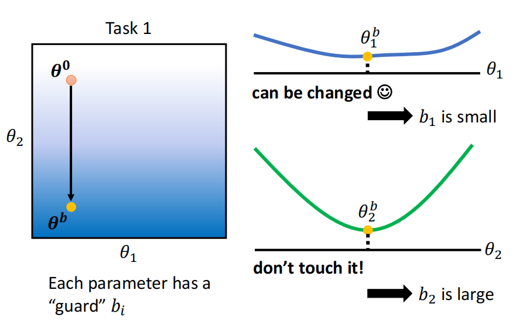

##### 3. Algorithm-Centric(感觉可以和上一个合并)  这里还稍微差点，不过我还不想写！ 

LwF 、BiC（矫正偏好，用验证集去矫正输出bias）

##### 4. Discussion for from-scratch-method

- 数据集：用的最多的都是CIFAR100、ImageNet100、ImageNet1000这种，算是比较小的，因为是train from scratch的。
- Dynamic Network的方法还是占据着表现力主导地位的
- 用预训练的方式来和这些方法对比实际上是不公平的（除非它们的backbone也使用预训练的方式），原因：
  - 这些模型是从头开始训练，挑战难度会更大
  - 预训练的数据集与实际训练和测试的数据集可能会有大量重合，导致其性能远高于这种scratch的模型。
  - 当给足够的空间资源时，动态网络是能够表现出很好的作用。但当资源限制时，就不一定能表现出最好的能力。因此需要做一个memory-agnostic的对比。文中提出的AUC-A和AUC-L是很好地选择。

------

#### 💡Pretrained

##### Prompt-Centric

和rehearsal-based的方式比较一下？就是不需要exampler去记录过去的类别，而是用一些特定的prompt。主要思想是，prompt由几个token组成，是可调的。但是image token是不可调的。下面还要看一下那个预训练模型固不固定把。

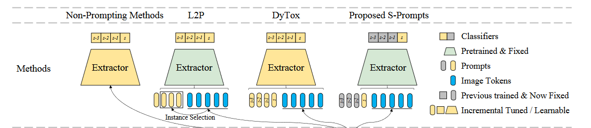

- DyTox: 第一篇在continual learning中用ViT的文章（CVPR2022）每个task，制定一个独立的token和专属分类器（加起来的参数和整个预训练模型相比是很少的）。推理的时候，每个任务的token都将加到image token上（相当于原来的class token），然后送到专属分类器里面进行分类。

- L2P：有一个prompt pool，里面是key-value paired，并且是固定数量的。input通过预训练模型提取得到query，然后匹配从prompt pool里面提取几个Token作为可训练的prompt，直接加入到image embedding前面（当作class token）进行训练。最后根据这个prompt对应的token，做平均得到预测类别。文章默认了这个prompt池里面的prompt既可以学习到共享知识，也能学到独立的知识。但文章还是用了一些rehearsal的方式，来和有buffer size的方法进行比较。文章没有说具体回放形式，应该是随机采样。

  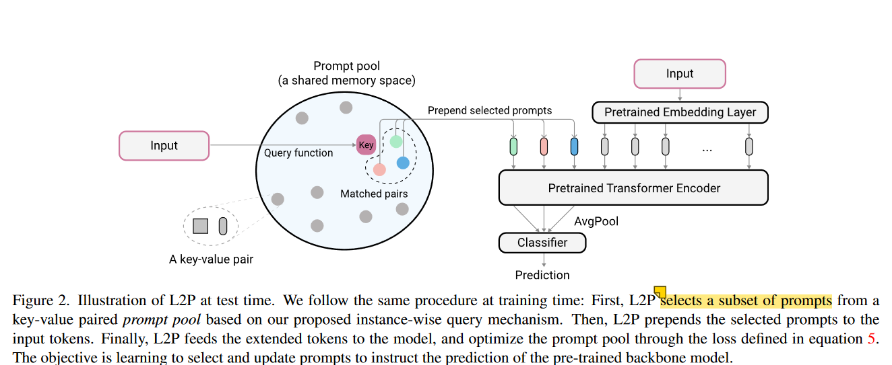

- Dual-Prompt：强调是rehearsal-free的方式，并且把L2P里面的prompt pool进行了解耦。G-Prompt用来学习底层的，共享的特征，E-Prompt来处理比较高层的，具有判别性的特征。而且这些prompt插入的层不一样，G-Prompt主要插入在前两层，而E-Prompt插入在3-5层表现最好。G-Prompt长度5最好，E-Prompt长度20最好。

  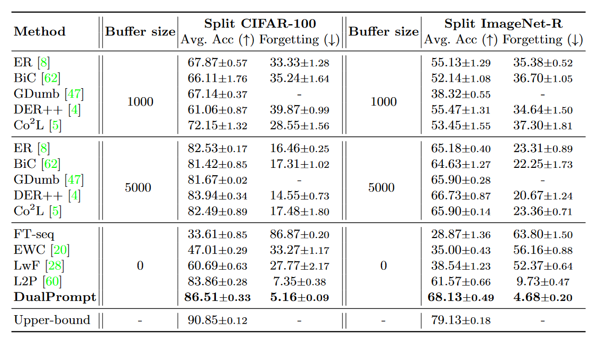

  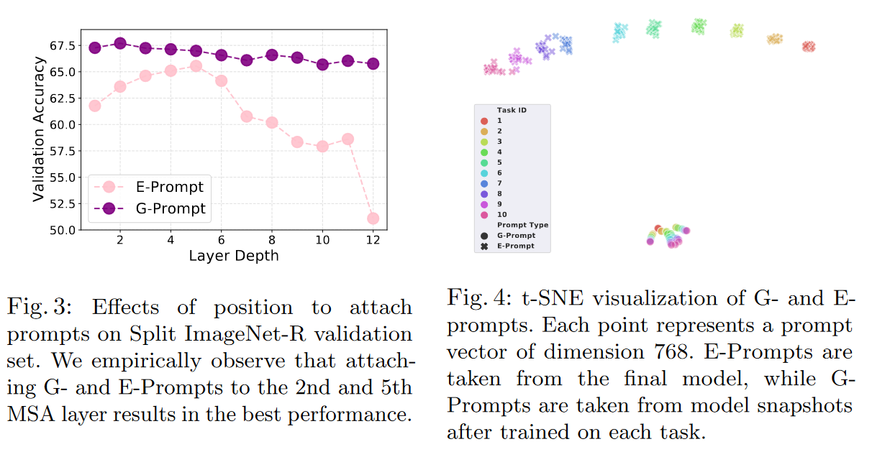

- S-Prompt：和DyTox有点像，但这个是每一个**域**对应于一个（或几个）image token和一个tunable text prefix token，仅仅对域token和末端分类器进行微调。推理的时候用KNN选取距离图像特征最近的域特征中心（K-Means选出的）所代表的Prompt。然后像CLIP那样进行相似度匹配。

  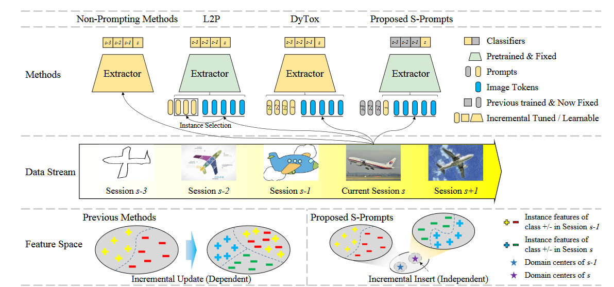

  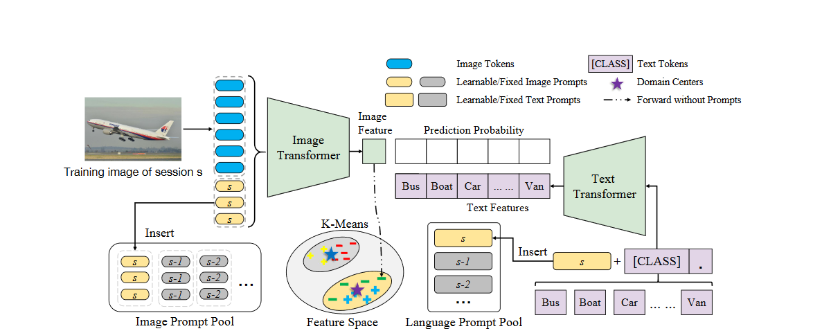

- CODA-Prompt(可选)

##### Parameter-efficient

- **ADAM** (Adapt and merge)

  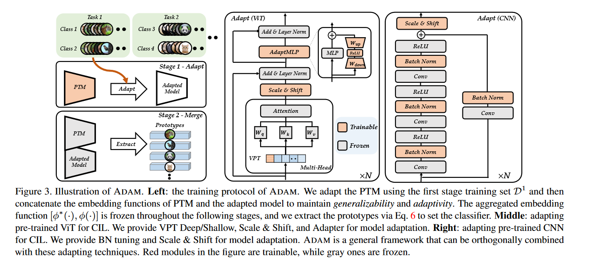

  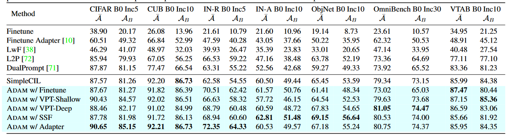

  - Model adaptation: 用PEFT的方式，获得一个adapted model。PEFT方式包括VPT、Scale&Shict、Adapter还有Batch Normalization Tuning。
  - Merge with pre-trained：直接出来一个预训练的特征，然后和上面adapted model的concat在一起。

- LAE(ICCV2023)

##### multi-modal

+CLIP的  KNN-CLIP（但只是小数据集的）（最好今晚）

##### Other

- **ELLE**: model expansion的思想，是NLP领域的，针对的是Transformer的结构调整

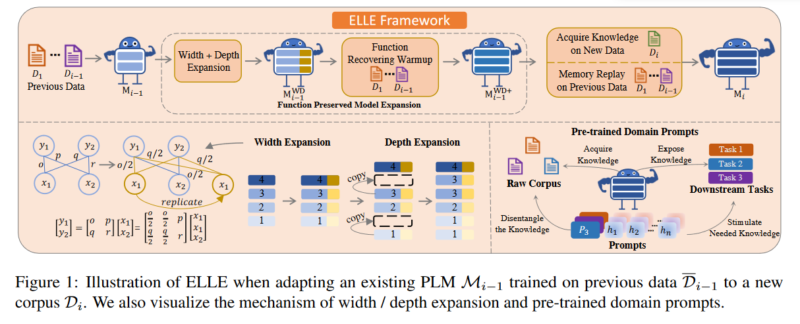

​	- 模型的宽度和深度都扩展了，而且还通过了一个function recover的方式，来在扩张的模型上保持原有模型的功能。深度扩充就是把中间的一些层复制多一份。而且还添加了预训练的domain prompt，来告诉它处于哪个领域？

**Discussion for pre-trained-method**

- 结合生物学思想: **combine with more Neuroscience knowledge**
- transformer的decoder是否可以用来做generative的replay?  **用generative和replay的那种思想**
- 在**更具挑战性的benchmark**上进行实验，而非那种from scratch的小实验   **more challenging benchmark**