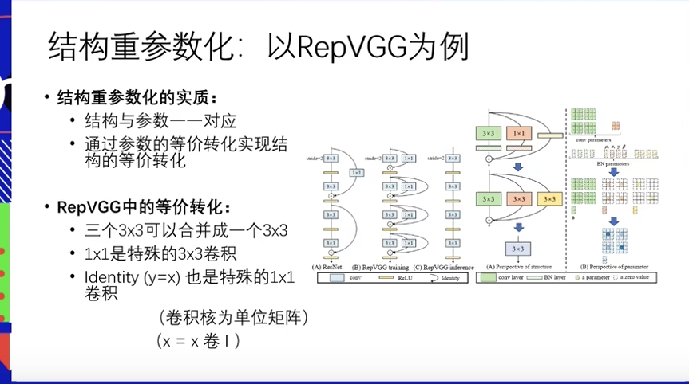

> 读一篇论文的时候，更重要的是需要思考怎么想到idea?怎么就能变成一个paper?
>
> 怎么解决单分支模型的性能不好？

- RepVGG: 从头到尾全是分支，没有卷积，并行度高，对硬件友好

- ResNet是多分支模型，训练精度高，推理效率低

- RepVGG单路，训练精度低，推理效率高

**单分支模型和多分支模型的区别**

- 训练时：多分支（+一个1×1卷积 and 一个identity）    

- 推理时：单分支（等价为一个3×3）

**为什么说1×1卷积是3×3卷积的一种？**

1×1卷积应该是3×3卷积仅有左上角为1的情况。所以1×1能够转换为3×3

今天就先到这里，周末稍微和小姐妹玩一玩也不算过分?